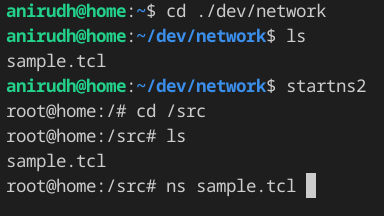

# Network Simulator 2

## Installation Instructions
You need to install docker to build and run images. You can use the following commands to install docker:
```bash
sudo apt install docker.io
# the following commands allow user to run docker without sudo (optional)
sudo groupadd docker
sudo usermod -aG docker $USER
newgrp docker
```
Build the image using the following command:
```bash
docker build -t ns2 .
```

You can run the image using the command specified in `run.sh` script.   
Optionally, you can add the following line to the end of  `~/.bashrc` for easier access:
```bash
alias startns2='docker run --rm -ti -v $(pwd):/src  --net=host --env="DISPLAY" --volume="$HOME/.Xauthority:/root/.Xauthority:rw" ns2'
```

Now to use this image to run the simulator you can use the following commands:
```bash
cd /path/in/which/your/code/is/present
# the following  command starts the container
startns2 # or run the command present in run.sh
```

Now you can `cd /src` and view the code present in the directory `startns2` was run from(basically files present in `/path/in/which/your/code/is/present`).

Example:  



## Testing your installation
Run the following commands inside the container to check if ns2 is working properly
```bash
wget http://nile.wpi.edu/NS/Example/ns-simple.tcl
ns ns-simple.tcl
```

## Troubleshooting
If you are getting an error message like `No protocol specified` when running `nam` or `xgraph` you need to run `xhost +` before starting the container (using `startns2` command). After closing the container you can run `xhost -` to restore this change. Refer to this [link](https://riptutorial.com/docker/example/21831/running-gui-apps-in-a-linux-container) if you have additional errors.

**PS: All these scripts work only if you use X11 on your system.**
